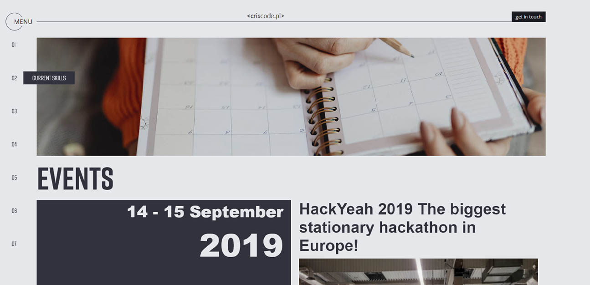

# CrisCode.pl
If you want to know how my portfolio looks like click here -> [criscode.pl](http://criscode.pl)

## The aim of this project 🚀
My aim of this project is creating Portfolio website using React.js as a main environment.

## What I've used here?
- 👍 Semantic HTML5
- 👍 CSS Modules and SASS
- 👍 BEM methodology
- 👍 Adobe XD
- 👍 React.js
- 👍 React Router
- 👍 Rest Api - from GITHUB

## The tools I've used:
- ✔ Visual Studio Code
- ✔ Adobe XD,
- ✔ Create React App
